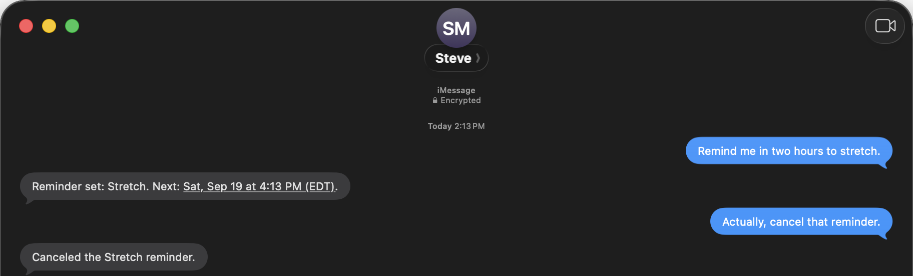
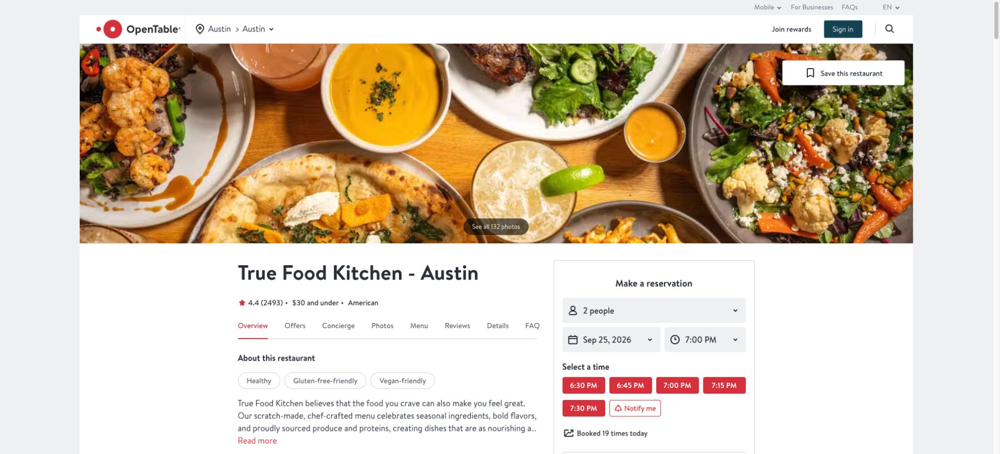
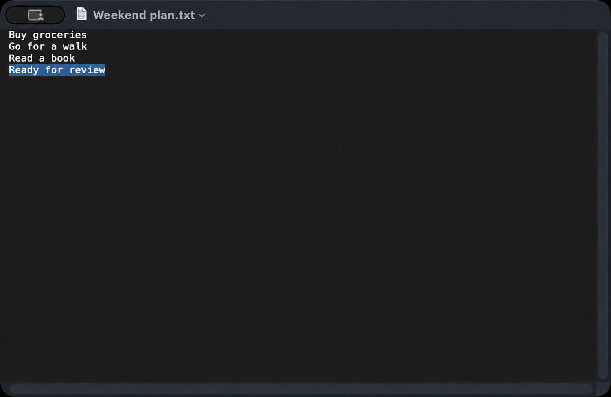

# Steve

**Text a Codex agent through iMessage.**

Steve runs on your Mac, uses your existing Codex login and browser session, and sends results back through iMessage. No OpenAI API key or iPhone app is required. Ask it to research the web, operate apps, manage reminders, check connected services, or send back files and recordings.



A real reminder conversation, captured at native resolution. The reminder was cancelled after the demo.

## What you can ask Steve

> Research the best monitor arm under $100.
>
> Remind me tomorrow at 9 AM to call the dentist.
>
> Check my email for the reservation confirmation.
>
> Record a short video showing me what you changed.

Email needs a connected account; video needs Steve's Screen Recording permission.

```text
iPhone → iMessage → Steve on your Mac → Codex → apps and websites
       ← results, files, and recordings ←
```

**Development preview:** iMessage tasks, browser research, reminders, email reads, and video delivery have been exercised on a Mac. Phone login, iPhone video playback, and calendar support have [remaining limitations](guide/preview-limitations.md). MIT licensed.

<details>
<summary><strong>See real tasks: restaurant research and a recorded document</strong></summary>

**Check dinner availability.** Steve checked restaurant menus and live booking pages for two people in Austin, including vegetarian options and outdoor seating. This original browser capture shows the date, party size, and available times observed on September 19, 2026. No reservation was submitted; availability can change.



**Create a file and send a recording.** Steve saved a four-line Weekend plan in TextEdit and delivered the file and a document-only video through iMessage. This frame shows the finished note with “Ready for review” selected. It shows the final state, not the editing or window-closing sequence.



AI-upscaled for readability; [view the original video frame](guide/images/weekend-plan-original.png). The original recording was decoded and checked on a Mac; physical iPhone playback remains unverified.

</details>

**Requires:** an Apple silicon Mac with macOS 14+, Codex, and a **separate Messages account on the Mac running Steve**. Computer Use has its own availability and macOS requirements; see [setup](guide/setup.md). Same-account self-messaging is outside this setup flow.

## Install with an agent

Native Computer Use lets Steve operate visible apps and websites on your Mac.

Give a local Codex agent [this repository](https://github.com/swaymun/steve) and say:

> Set up Steve on this Mac. Follow AGENTS.md and guide/setup.md, use the newest compatible signed release including previews, and guide me through permissions, iMessage pairing, and native Computer Use.

The agent can install and launch Steve, inspect setup, open the right macOS permission pane, and show the app you need to add. **You grant permissions, finish sign-in, and send the pairing code.** It then helps set up native Computer Use using your existing browser profile. No Chrome extension or iPhone extension is needed.

The setup sequence is:

1. Install and launch Steve.
2. Run `setup --non-interactive --json` and resolve the reported human steps.
3. Pair iMessage, then install/enable native Computer Use and its permissions.
4. Run `doctor --json` and `status --json`.
5. Text Steve: **“Open example.com and tell me the heading.”** Verify the browser result before calling setup complete.

The commands use the running app's local CLI. A web chat without local Mac tools cannot perform the installation. See the [ordered setup guide](guide/setup.md#cli-onboarding) for exact commands and how to interpret readiness.

## Install manually

[Download v0.1.2 for Apple silicon](https://github.com/swaymun/steve/releases/download/v0.1.2/Steve-macOS.zip) · [SHA-256 checksum](https://github.com/swaymun/steve/releases/download/v0.1.2/Steve-macOS.zip.sha256) · [Release notes](https://github.com/swaymun/steve/releases/tag/v0.1.2)

Use macOS 14 or later with Codex installed and signed in. The prebuilt app is Developer ID signed and notarized by Apple; no source build is needed. Native Computer Use has its own availability and macOS requirements. The Mac must remain awake, signed in, and running Steve.

**Messages accounts:** the tested setup uses a separate Messages account on Steve's Mac from the person texting it. Same-account self-messaging is not supported by this onboarding flow: Steve ignores messages marked as sent by its own account.

[Verify the download, move Steve.app into Applications, and launch it](guide/setup.md#install-a-release). Then follow the same pairing and Computer Use sequence above. These downloads are currently **GitHub prereleases**; agents must include prereleases when discovering builds. Intel users can [build from source](guide/setup.md#build-from-source), but Intel builds have not been validated.

## Permissions and privacy

macOS asks you to grant these permissions yourself. Steve's access profile and the operating system's permissions are separate controls.

| Permission | Used by | Why it is needed |
| --- | --- | --- |
| Full Disk Access | Steve | Reads the local Messages database. This is a broad macOS grant; Steve enforces the exact paired conversation and sender in its own code. |
| Automation → Messages | Steve | Sends replies and attachments through the public Messages AppleScript interface. |
| Screen Recording and Accessibility | The installed Computer Use app | Views and operates visible browsers and apps for your tasks. |
| Screen Recording | Steve, optional | Records requested video evidence or shows the Mac display during phone control. |
| Accessibility | Steve, optional | Sends your phone-control clicks and typing to the Mac. |
| VPN connection | Tailscale on the Mac and phone, optional | Keeps the phone-control page inside your private network with Tailscale Serve. Public Funnel is not used. |
| Account and integration access | Codex and the services you connect | Runs the selected model and accesses only the integrations you authorize. Codex owns its authentication; Steve does not store ChatGPT tokens. |

Choose Read Only, Workspace Write, or Full Access deliberately. Full Access allows commands without individual command approval and is powerful; it does not itself grant permission for unrelated purchases, bookings, or messages. The default browser session can already be signed in to your accounts, so choose a profile you are comfortable using for tasks.

Messages content and relevant task context are sent to Codex to process requests. Steve stores pairing, queues, settings, and thread IDs locally in `~/.steve`; Codex maintains its own conversations. Phone-control images and typed input stay out of Steve's model conversation and recordings. The shared display can include other visible apps, so close private windows before taking control. Native video defaults to one selected window; optional system audio requires an explicit request, and microphone recording is not supported. Never paste passwords, one-time login codes, or payment details into iMessage.


## How Steve works

Steve is a native SwiftUI menu-bar app. A persistent relay interprets messages and formats verified results; a persistent worker performs tasks through the installed Codex App Server. Context can be reused or compacted. Codex owns authentication; Steve stores no ChatGPT tokens and needs no OpenAI API key.

Native Computer Use operates the visible browser and apps. Steve reads the local Messages database and sends replies through public AppleScript. Queues, saved preferences, reminders, and task state persist across restarts. Ambiguous executions or sends need review and are never automatically replayed.

One exact private conversation is paired with a short-lived code. Other chats, groups, and mismatched senders cannot operate Steve. Use ordinary language for tasks. Say **status** to inspect work, **/stop** to pause, or **resume** to accept work again. Old failures are labeled separately as History.

Optional [phone control](guide/setup.md#phone-control-in-safari) shows the Mac's current browser session in Safari through private Tailscale Serve. Tailscale is required on both devices for this feature; basic messaging and Computer Use do not need it.

## Development

macOS 14 or later and a Swift toolchain compatible with `native/Package.swift` and its locked dependencies are required.

```sh
swift test --package-path native
swift build --package-path native --configuration release
./scripts/build-native.sh
```

Tests use fixtures and never send live iMessages. Live acceptance runs require an explicitly authorized conversation. Raw histories, local settings, diagnostic logs, and development artifacts must stay out of public commits. Publish only screenshots reviewed for public disclosure, such as the demo above.

See [third-party notices](THIRD_PARTY_NOTICES.md) and [the release checklist](guide/release-checklist.md).
