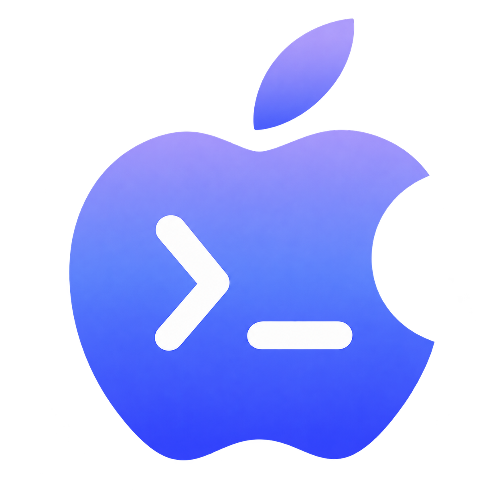
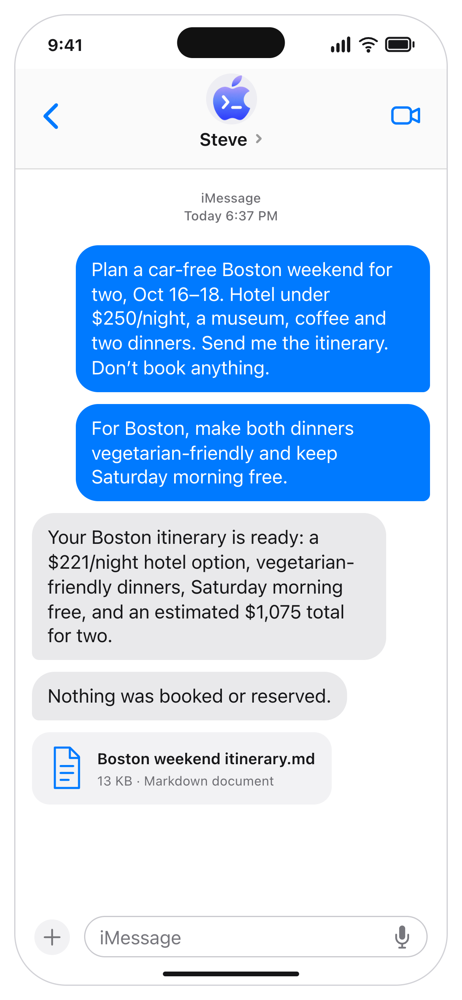
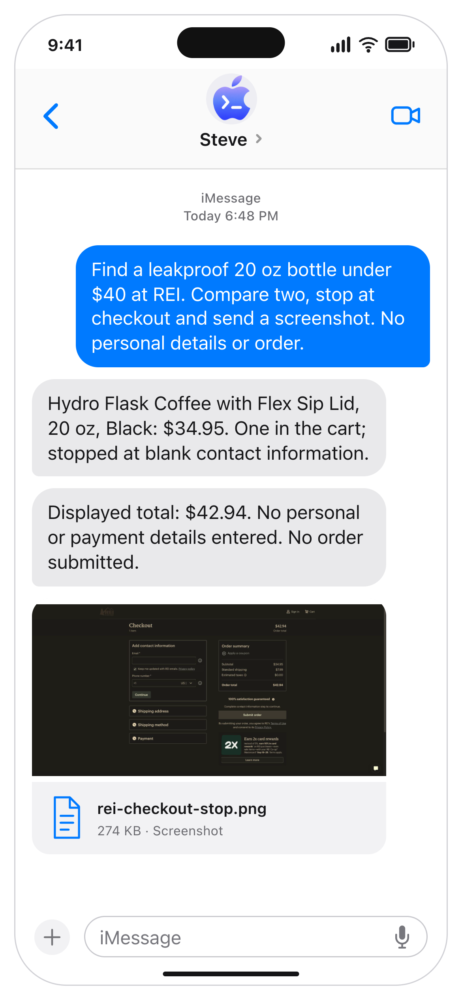
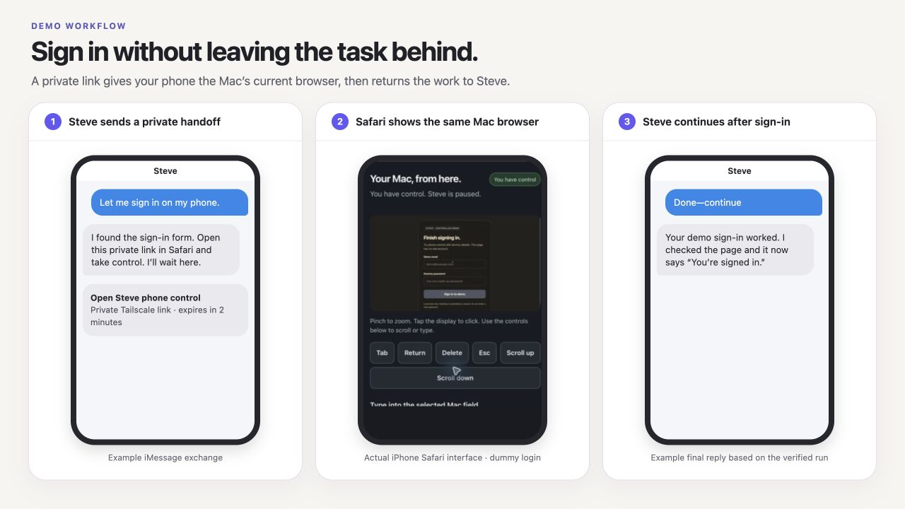

# Steve

**Text a Codex agent through iMessage.**

Steve runs on your Mac, uses your existing Codex login and browser session, and sends results back through iMessage. No OpenAI API key or iPhone app is required. Ask it to research the web, operate apps, manage reminders, check connected services, or send back files and recordings.

<p>
  
  
</p>

Example conversations from tested Steve workflows.

## What you can ask Steve

> Research the best monitor arm under $100.
>
> Remind me tomorrow at 9 AM to call the dentist.
>
> Check my email for the reservation confirmation.
>
> Record a short video showing me what you changed.

Email needs a connected account; video needs Steve's Screen Recording permission.

Replies use plain text. Guides, reports, and itineraries are delivered as PDFs for reading in Messages; ask for Markdown or another source format when you want an editable copy.

```text
iPhone → iMessage → Steve on your Mac → Codex → apps and websites
       ← results, files, and recordings ←
```

**Steve 1.0:** [Current support and limits](guide/preview-limitations.md). MIT licensed.

**Requires:** an Apple silicon Mac with macOS 14+, **Codex installed and signed in**, and a **separate Messages account on the Mac running Steve**. Computer Use has its own availability and macOS requirements; see [setup](guide/setup.md). Same-account self-messaging is outside this setup flow.

## Install with an agent

Native Computer Use lets Steve operate visible apps and websites on your Mac.

Use **Astra in the local Codex desktop app** for guided setup. Other local agents work too; Astra is recommended for walking through choices and permission handoffs. Give it [this repository](https://github.com/swaymun/steve) and say:

> Set up Steve on this Mac. Follow AGENTS.md and guide/setup.md. Help me choose models, connect iMessage, check permissions, and try a browser task. Offer phone sign-in too.

The agent installs the newest compatible signed release, opens the right permission panes, and asks one short question at a time. Choose recommended models or customize them, including how many workers can run at once. **You grant permissions, finish sign-in, choose the owner, and send the first ordinary iMessage.** Check access together while you are at the Mac, so requests sent later do not get stuck behind permission prompts. No Chrome extension or iPhone extension is needed.

The setup sequence is:

1. Install and launch Steve.
2. Run `setup --non-interactive --json` and resolve the reported human steps.
3. Choose the owner and model settings, then connect iMessage and enable native Computer Use.
4. Run `doctor --json` and `status --json`.
5. Say **“Hi”** and accept the offered browser check, or ask **“Open example.com and tell me the heading.”** Verify Steve’s reply and browser result.
6. Optionally set up Tailscale on the Mac and iPhone, then try private phone sign-in before leaving the Mac.

The commands use the running app's local CLI. A web chat without local Mac tools cannot perform the installation. See the [ordered setup guide](guide/setup.md#cli-onboarding) for exact commands and how to interpret readiness.

## Install manually

[Download v1.0.0 for Apple silicon](https://github.com/swaymun/steve/releases/download/v1.0.0/Steve-macOS.zip) · [SHA-256 checksum](https://github.com/swaymun/steve/releases/download/v1.0.0/Steve-macOS.zip.sha256) · [Release notes](https://github.com/swaymun/steve/releases/tag/v1.0.0)

Use macOS 14 or later with Codex installed and signed in. The prebuilt app is Developer ID signed and notarized by Apple; no source build is needed. Native Computer Use has its own availability and macOS requirements. The Mac must remain awake, signed in, and running Steve.

The release app checks for signed updates automatically and installs them when Steve is idle. You can change this or check manually from **Advanced** in the menu-bar app.

**Messages accounts:** the tested setup uses a separate Messages account on Steve's Mac from the person texting it. Same-account self-messaging is not supported by this onboarding flow: Steve ignores messages marked as sent by its own account.

[Verify the download, move Steve.app into Applications, and launch it](guide/setup.md#install-a-release). Then follow the same pairing and Computer Use sequence above. Release discovery includes compatible prereleases as well as stable releases. Intel users can [build from source](guide/setup.md#build-from-source), but Intel builds have not been validated.

## Sign in from your phone

When a task needs a website login, Steve can send a private link that lets Safari control the **same browser session on your Mac**. Take control, finish signing in, then tap **Done—continue** to return the task to Steve. Your password is not sent through iMessage or added to the agent's conversation.



This optional feature uses [private Tailscale Serve](guide/setup.md#optional-tailscale-setup), with Tailscale connected on both devices and separate Steve capture/input permissions. Without it, website sign-in may require returning to the Mac.

## Permissions and privacy

macOS asks you to grant these permissions yourself. Steve's access profile and the operating system's permissions are separate controls.

| Permission | Used by | Why it is needed |
| --- | --- | --- |
| Full Disk Access | Steve | Reads the local Messages database. This is a broad macOS grant; Steve enforces the exact paired conversation and sender in its own code. |
| Automation → Messages | Steve | Sends replies and attachments through the public Messages AppleScript interface. |
| Screen Recording and Accessibility | The installed Computer Use app | Views and operates visible browsers and apps for your tasks. |
| Screen Recording | Steve, optional | Records requested video evidence or shows the Mac display during phone control. |
| Accessibility | Steve, optional | Sends your phone-control clicks and typing to the Mac. |
| VPN connection | Tailscale on the Mac and phone, optional | Keeps the phone-control page inside your private network with Tailscale Serve. Public Funnel is not used. |
| Account and integration access | Codex and the services you connect | Runs the selected model and accesses only the integrations you authorize. Codex owns its authentication; Steve does not store ChatGPT tokens. |

Choose Read Only, Workspace Write, or Full Access deliberately. Full Access allows commands without individual command approval and is powerful; it does not itself grant permission for unrelated purchases, bookings, or messages. The default browser session can already be signed in to your accounts, so choose a profile you are comfortable using for tasks.

Messages content and relevant task context are sent to Codex to process requests. Steve keeps its settings, queues and private runtime in `~/.steve`; internal agent chats stay out of your Codex sidebar. Phone-control images and typed input stay out of Steve's model conversation and recordings. The shared display can include other visible apps, so close private windows before taking control. Native video defaults to one selected window; optional system audio requires an explicit request, and microphone recording is not supported. Never paste passwords, one-time login codes, or payment details into iMessage.


## How Steve works

Steve is a native SwiftUI menu-bar app that uses your installed Codex to carry out requests and keep task context. Models and task settings are [configurable](guide/setup.md#coordinator-and-worker-settings).

Steve can work on two independent tasks at once by default, including tasks that use the browser or other Mac apps. They share the same desktop and browser profile, so simultaneous changes to the same page can interfere. Say “Also…” to start another goal, correct a task in ordinary language, or ask Steve to cancel a named task.

Native Computer Use operates the visible browser and apps. Steve reads the local Messages database and sends replies through public AppleScript. Queues, saved preferences, reminders, and task state persist across restarts. Ambiguous executions or sends need review and are never automatically replayed.

One exact private conversation connects when the owner chosen during setup sends a new iMessage. A short-lived code remains an optional fallback. Other chats, groups, and mismatched senders cannot operate Steve. Use ordinary language for tasks. Say **status** to inspect work, **/stop** to cancel active and queued requests and pause, or **resume** to accept work again. Old failures are labeled separately as History.

Optional [phone control](guide/setup.md#phone-control-in-safari) shows the Mac's current browser session in Safari through private Tailscale Serve. Tailscale is required on both devices for this feature; basic messaging and Computer Use do not need it.

Add services through [Codex MCP integrations](guide/setup.md#mcp-integrations) on the Mac running Steve. Steve can use compatible, authenticated servers without a service-specific adapter.

## Development

macOS 14 or later and a Swift toolchain compatible with `native/Package.swift` and its locked dependencies are required.

```sh
swift test --package-path native
swift build --package-path native --configuration release
./scripts/build-native.sh
```

Tests use fixtures and never send live iMessages. Live acceptance runs require an explicitly authorized conversation. Raw histories, local settings, diagnostic logs, and development artifacts must stay out of public commits. Publish only screenshots reviewed for public disclosure, such as the demos above.

See [third-party notices](THIRD_PARTY_NOTICES.md) and [the release checklist](guide/release-checklist.md).
