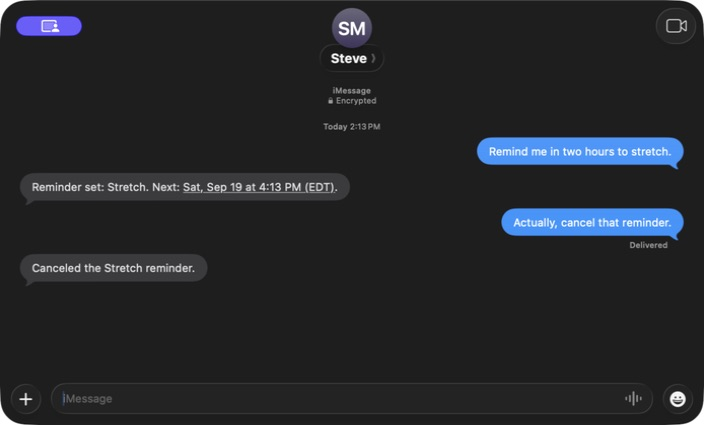

# Steve

Steve connects one private iMessage conversation to a persistent operator on your Mac. A small native menu-bar app owns Messages, the workspace boundary, and a relay/worker pair running through the installed Codex App Server. Authentication stays with Codex; Steve does not store ChatGPT tokens or require an OpenAI API key.



An actual conversation with Steve running on another Mac. The reminder was cancelled after the screenshot demo; no scheduled reminder remains from it.

**Development preview.** Paired iMessage delivery, preferences, reminders, browser research, bounded email reads, and native video delivery have been exercised on a Mac. Calendar coverage is partial, and complete phone login and video playback on an iPhone still need acceptance testing. See the [practical benchmark report](guide/practical-benchmark-20260919.md) for results and limitations. Steve is MIT licensed.

## Install

Use a Mac running macOS 14 or later, signed in to Messages, with Codex installed and signed in. The Mac must stay awake and Steve must remain running to perform tasks. Basic messaging needs no iPhone extension or companion app.

Prebuilt downloads will be on [GitHub Releases](https://github.com/swaymun/steve/releases). **The first signed, notarized download is still pending.** Once available, download `Steve-macOS.zip` and its SHA-256 checksum, verify them using [the setup guide](guide/setup.md#install-a-release), and move `Steve.app` to Applications. Release notes identify the supported Mac architecture. Until that archive is published, [source installation](guide/setup.md#build-from-source) is available.

Open Steve, finish Codex sign-in and macOS permissions, choose a workspace and access profile, then pair your private iMessage conversation with the displayed code. Add Steve as a contact on your phone and ask for a task in normal language.

## Set it up with your agent

Give a local coding agent this repository and the following request:

> Help me install Steve from this repository. Read AGENTS.md and guide/setup.md first. Inspect my existing installation and dependencies and preserve my settings and data. Prefer the latest compatible signed, notarized release and verify its checksum and signature; if none exists, explain the source-build option. Run the installed app's setup --non-interactive --json command. Explain each needs_user_action step and help me finish account login, macOS permissions, and exact iMessage pairing. Use my existing browser profile. Ask for any missing access choice rather than enabling full computer access automatically. Do not copy credentials into chat or send a live test until I authorize the destination.

The agent needs local tools on the Mac that will run Steve. A web chat without local access cannot install a Mac app. Follow [the setup guide](guide/setup.md) for manual installation and machine-readable commands.

## How it works

- The persistent relay interprets requests and formats verified results; a persistent worker performs the task. Context can be reused, compacted, or deliberately reset.
- The installed Computer Use plugin operates visible Chrome using the existing profile. Install the plugin through its supported ChatGPT/Codex flow; it is not redistributed in this repository.
- Incoming messages and outgoing parts are persisted. Restart recovery preserves queued requests. Ambiguous executions or sends are recorded for review rather than automatically replayed.
- Explicitly saved preferences survive restart and can be listed or forgotten. Reminders and scheduled tasks use durable records and explicit timezones; uncertain outcomes block automatic repetition.
- One exact private conversation is paired with a short-lived code. Other chats, group conversations, and mismatched senders cannot operate Steve.
- Say what you want in normal language, such as “Remind me in two hours to stretch” or “Find me a good cable organizer under $25.” Steve handles tools, context, and verification; remaining decisions use “yes” or “no.” `/stop` is the emergency pause command. Say “resume” to continue accepting work or “status” to inspect the current state. A stopped task with uncertain side effects is not automatically rerun.

Steve uses read-only access to the local Messages database and public AppleScript sending. It does not require private Messages frameworks or SIP changes. Optional phone control uses Safari to show the Mac's current browser session; it requires Tailscale on both devices, connected to the same private network. A URL alone does not make that page public. See [phone setup](guide/setup.md#optional-tailscale-setup).

## Permissions and privacy

macOS asks you to grant these permissions yourself. Steve's access profile and the operating system's permissions are separate controls.

| Permission | Used by | Why it is needed |
| --- | --- | --- |
| Full Disk Access | Steve | Reads the local Messages database. This is a broad macOS grant; Steve enforces the exact paired conversation and sender in its own code. |
| Automation → Messages | Steve | Sends replies and attachments through the public Messages AppleScript interface. |
| Screen Recording and Accessibility | The installed Computer Use app | Views and operates visible browsers and apps for your tasks. |
| Screen Recording | Steve, optional | Records requested video evidence or shows the Mac display during phone control. |
| Accessibility | Steve, optional | Sends your phone-control clicks and typing to the Mac. |
| VPN connection | Tailscale on the Mac and phone, optional | Keeps the phone-control page inside your private network with Tailscale Serve. Public Funnel is not used. |
| Account and integration access | Codex and the services you connect | Runs the selected model and accesses only the integrations you authorize. Codex owns its authentication; Steve does not store ChatGPT tokens. |

Choose Read Only, Workspace Write, or Full Access deliberately. Full Access allows commands without individual command approval and is powerful; it does not itself grant permission for unrelated purchases, bookings, or messages. The default browser session can already be signed in to your accounts, so choose a profile you are comfortable using for tasks.

Messages content and relevant task context are sent to Codex to process requests. Steve stores pairing, queues, settings, and thread IDs locally in `~/.steve`; Codex maintains its own conversations. Phone-control images and typed input stay out of Steve's model conversation and recordings. The shared display can include other visible apps, so close private windows before taking control. Native video defaults to one selected window; optional system audio requires an explicit request, and microphone recording is not supported. Never paste passwords, one-time login codes, or payment details into iMessage.

## Development

macOS 14 or later and a Swift toolchain compatible with `native/Package.swift` and its locked dependencies are required.

```sh
swift test --package-path native
swift build --package-path native --configuration release
./scripts/build-native.sh
```

Tests use fixtures and never send live iMessages. Live acceptance runs require an explicitly authorized conversation. Raw histories, local settings, diagnostic logs, and development artifacts must stay out of public commits. Publish only screenshots reviewed for public disclosure, such as the demo above.

See [third-party notices](THIRD_PARTY_NOTICES.md) and [the release checklist](guide/release-checklist.md).
